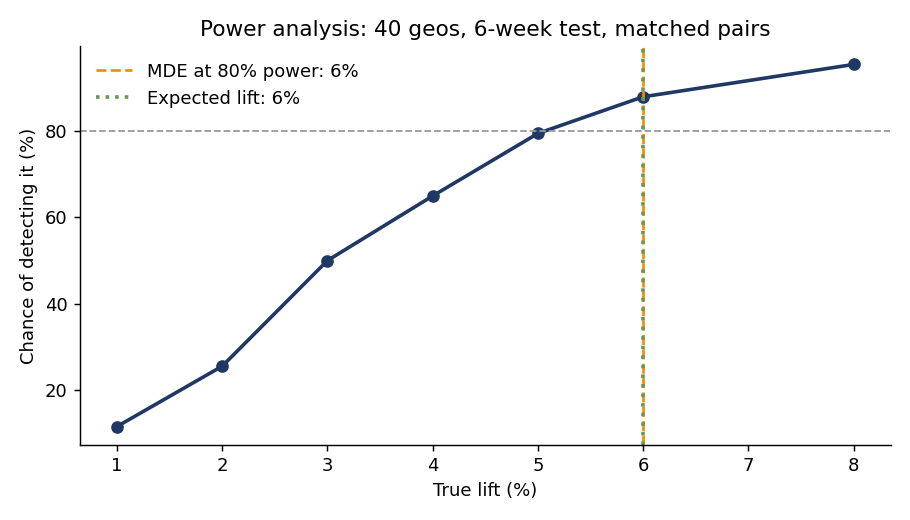
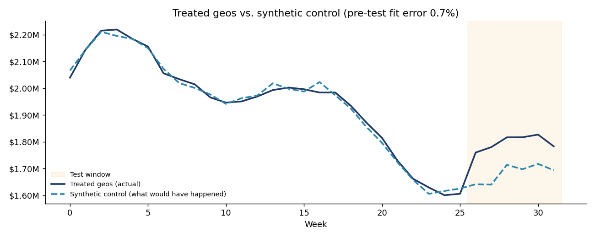
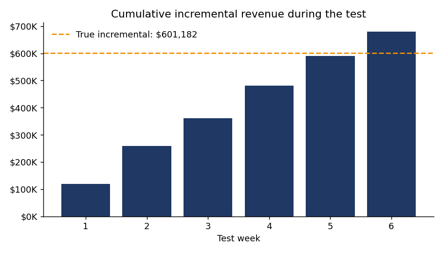
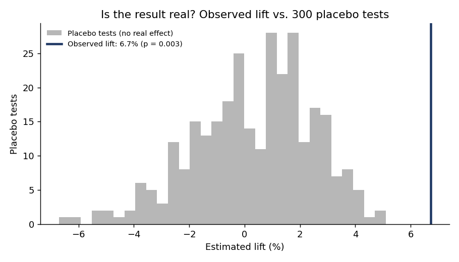
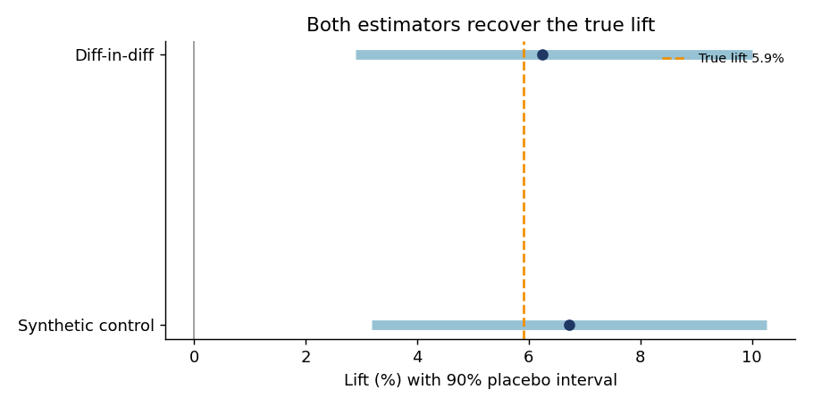

# Geo Incrementality Testing

[](https://colab.research.google.com/github/YOUR-USERNAME/geo-incrementality/blob/main/notebooks/geo_incrementality_codealong.ipynb)


A complete geo holdout test in plain Python: power analysis, market assignment, lift measurement and significance testing. It answers the question platform dashboards can't:

**Did the campaign cause those sales, or would they have happened anyway?**

Turn a campaign on in some markets, hold others out, and compare. Doing that credibly takes four steps, and this project implements all four:

1. **Power analysis.** Before spending anything, confirm the test can detect the lift you expect.
2. **Assignment.** Split markets into treatment and control so the two groups are genuinely comparable.
3. **Measurement.** Estimate what treated markets would have done without the campaign.
4. **Inference.** Prove the result isn't noise, and put an honest interval around it.

The data is simulated with a **known** true lift, so every step can be checked against the truth.

## 🎓 Code-along

New to incrementality testing? The [Colab code-along](notebooks/geo_incrementality_codealong.ipynb) builds every method from scratch, explains the theory behind each step, and includes check-your-understanding questions and exercises. It runs free in the browser in about 45–60 minutes, with no setup.

## Results

| Check | Result |
|---|---|
| True lift | **5.90%** |
| Estimated lift (synthetic control) | **6.72%**, 90% interval 3.2% – 10.3%, p = 0.003 |
| Estimated lift (difference-in-differences) | **6.24%**, 90% interval 2.9% – 10.0%, p = 0.007 |
| Pre-test fit of synthetic control | **0.7%** average error |
| 90% interval contained the truth, across 100 repeated tests | **90%** (exactly as designed) |
| Minimum detectable effect at 80% power | **6%** (88% power at the expected lift) |

### 1. Power analysis: will this test work?



Using historical data only, the design is stress-tested with hundreds of simulated campaigns at different lift sizes. With 40 geos and a 6-week test, a 6% lift is detected 88% of the time; a 3% lift only half the time. **If you expect a 3% lift, this design shouldn't launch as-is**: add markets, run longer, or spend more to push the lift up.

### 2. Measurement: what would have happened?



Synthetic control builds a weighted blend of control markets that tracks the treated markets almost perfectly before the test (0.7% error). During the test, the gap between the two lines is the incremental revenue.



### 3. Inference: is it real?



The same analysis is rerun on 300 fake tests where nothing happened. The observed lift is larger than all but a handful of them (p = 0.003). The spread of those placebo results also sets the confidence interval, with no normality assumptions required.



### The finding a CFO cares about

| Method | Incremental revenue | iROAS (90% interval) |
|---|---|---|
| Synthetic control | $679K | 1.91 (0.90 – 2.91) |
| Difference-in-differences | $633K | 1.78 (0.82 – 2.85) |
| **Truth** | **$601K** | **1.69** |

The test clearly proves the campaign **drove** sales. But the iROAS interval dips just below 1.0, so at 90% confidence it hasn't yet proven the campaign is **profitable**. Those are two different questions, and a good readout separates them. The fix is a longer or larger test, not a rounder number.

## How it works

| Step | Method | File |
|---|---|---|
| Assignment | Matched pairs: geos sorted by pre-period revenue, one of each pair randomly treated | `incrementality/design.py` |
| Power | Simulated lifts injected into historical data, detection rate vs. placebo threshold | `incrementality/design.py` |
| Estimation | Synthetic control (non-negative weights on control geos) and ratio difference-in-differences | `incrementality/analysis.py` |
| Inference | Placebo tests: p-value and interval from the no-effect distribution | `incrementality/analysis.py` |
| Simulation | 40 geos with their own size, trend, seasonality sensitivity and autocorrelated noise | `incrementality/data.py` |

## Run it

```bash
pip install -r requirements.txt
python run_demo.py     # writes charts, CSVs and results.md to ./outputs
pytest -q              # 6 tests: assignment, no-effect behavior, lift recovery, fit quality, significance
```

To use your own data, provide a long-format DataFrame with `geo`, `week` and `revenue`:

```python
from incrementality import to_wide, matched_pair_assignment, estimate
wide = to_wide(df)
result = estimate(wide, treated_geos, start=26, weeks=6, method="synthetic_control")
```

## Repository structure

```
incrementality/   the package: simulation, design and power, estimation and inference
notebooks/        Colab code-along that builds every method step by step
run_demo.py       end-to-end experiment that regenerates outputs/
tests/            6 tests covering assignment, estimation and significance
outputs/          charts, CSVs and results.md used in this README
```

## How this fits with MMM

Incrementality tests are the ground truth that keeps a marketing mix model honest. An MMM estimates every channel at once from observational data; a geo test measures one channel causally. The best practice is to use test results to calibrate the MMM. See the companion [marketing mix modeling](https://github.com/YOUR-USERNAME/mmm-from-first-principles) project.

## Limitations and next steps

* **Spillover.** People who live in control markets can see treated-market media, which biases lift toward zero. Choose geos with little media overlap.
* **Assumes the pre-period relationship holds.** A market-specific shock during the test (a local event, a competitor launch) can masquerade as lift.
* **Next steps:** augmented synthetic control, Bayesian structural time series (CausalImpact), and optimized market selection.

## About

Built by **Na'im McKee**, a marketing executive who has run attribution, testing and budget allocation in-house. Certified in incrementality testing and media mix modeling. [LinkedIn](https://linkedin.com/in/naimmckee)
